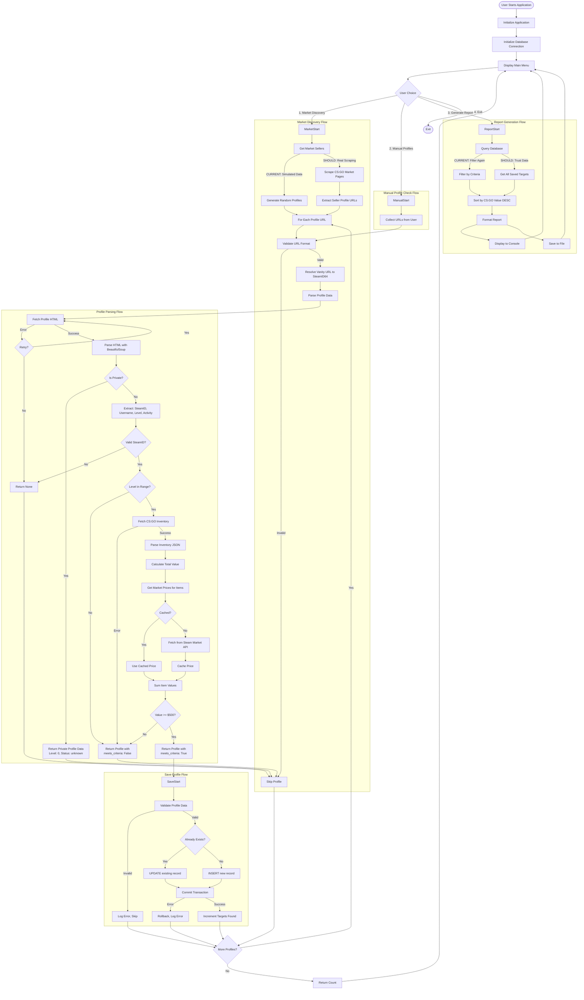

# Steam Profile Monitor ( parsing steam accounts)

A tool to automatically find Steam profiles that match specific criteria:
- Steam Level: 0-10
- CS:GO Inventory Value: > $500
- Activity Status: Active/Inactive

# issues 
1)the code can’t find steam profiles on its own
2)the code does not sort any accounts

# what can help ?
1)maybe adding a scraber will do it , however steam does not provide profiles ID's publically, that's why I tried doing it through cs go market
2)there is an extension in google that automatically gives you a price of an inventory , maybe it can be connected somehow to the code

## Setup Instructions 

1. **Install Python 3.8+** if not already installed

2. **Install required packages:**
   ```bash
   pip install -r requirements.txt


## Contribution by Cj458

I reviewed your current implementation and there are some flows. i outlined the complete redesign of your Steam Profile Monitor system, addressing critical logic inconsistencies and architectural issues. The redesign focuses on proper data flow, separation of concerns, and robust error handling.

## Current System Analysis

### System Intent
The Steam Profile Monitor discovers and monitors Steam profiles matching:
- **Steam Level Range**: 0-10
- **CS:GO Inventory Value**: > $500 USD
- **Activity Status**: Active or Inactive profiles

### Critical Logic Inconsistencies Identified

1. **Market Discovery Logic Flaw**
   - `discover_from_market(max_pages)` parameter is **completely ignored**
   - Uses hardcoded simulated data instead of actual market scraping which is fine for testing the functionality
   - No actual market integration

2. **Database Resource Management**
   - Database connections are **never closed** (resource leak)
   - No context managers for database operations
   - Connection persists for entire application lifetime

3. **Profile URL Resolution**
   - Cannot properly resolve vanity URLs (`/id/username`) to SteamID64
   - Returns "Unknown" SteamID for vanity URLs, causing inventory check to fail
   - No URL normalization or validation

4. **Criteria Evaluation Inconsistency**
   - Parser returns profiles with `meets_criteria: False` even when they don't meet criteria
   - Monitor only saves if `meets_criteria: True`, but parser still processes non-matching profiles
   - Private profiles return level 0, which will never meet criteria, but are still processed

5. **Error Handling Gaps**
   - No retry logic for failed HTTP requests
   - Single request failure causes entire profile to be skipped
   - No distinction between recoverable and non-recoverable errors

6. **Data Validation Missing**
   - Invalid SteamIDs can be saved to database
   - No validation of profile data before saving
   - Duplicate checking only by SteamID, not by URL

7. **Report Generation Redundancy**
   - Report filters by criteria again, but data should already be filtered
   - Suggests data integrity issues or design flaw

8. **Price Caching Issues**
   - Price cache is instance-level, lost between runs
   - No persistence or cache invalidation strategy
   - Cache grows unbounded

## Data Flow Analysis

### Current Data Flow (Problematic)

1. **Market Discovery Flow (BROKEN)**
   ```
   User Input (max_pages) → discover_from_market()
   → get_simulated_market_data() [IGNORES max_pages]
   → Returns hardcoded list
   → For each profile URL:
       → check_profile_criteria()
       → get_basic_profile_data() [May fail on vanity URLs]
       → get_csgo_inventory_value() [Fails if SteamID is "Unknown"]
       → Returns profile with meets_criteria flag
       → If meets_criteria: save_target_profile()
   ```

2. **Manual Profile Flow**
   ```
   User Input (URLs) → discover_from_manual_list()
   → For each URL:
       → check_profile_criteria() [Same issues as above]
       → If meets_criteria: save_target_profile()
   ```

3. **Report Generation Flow (REDUNDANT)**
   ```
   generate_report()
   → Query database with criteria filter [Why filter again?]
   → Sort by csgo_value DESC
   → Display and save to file
   ```

### Issues in Current Flow

- **No URL Resolution**: Vanity URLs (`/id/username`) never converted to SteamID64
- **No Early Rejection**: Processes entire profile even if level is wrong
- **No Retry Logic**: Single HTTP failure = lost profile
- **No Validation**: Invalid data can be saved
- **Resource Leaks**: Database connections never closed
- **Inefficient**: Fetches inventory even if level check fails

### Redesigned Data Flow (Correct)

1. **Market Discovery Flow (FIXED)**
   ```
   User Input (max_pages) → MarketScraper.discover_sellers(max_pages)
   → Actually scrape market pages [Respects max_pages]
   → Extract seller profile URLs
   → For each URL:
       → URLResolver.resolve() [Handles all formats]
       → If invalid: Skip with log
       → ProfileParser.parse() [With retry logic]
       → If private: Skip with log
       → CriteriaEvaluator.evaluate() [Early rejection]
       → If fails: Skip with reason logged
       → If passes: InventoryParser.get_value()
       → PriceParser.get_prices() [With caching]
       → Create SteamProfile object
       → Repository.save() [With validation]
       → Increment counter
   ```

2. **Manual Profile Flow (FIXED)**
   ```
   User Input (URLs) → Validate each URL
   → For each valid URL:
       → Same flow as Market Discovery
   ```

3. **Report Generation Flow (FIXED)**
   ```
   generate_report()
   → Repository.get_all_targets() [No filtering - data is already valid]
   → Sort by specified criteria
   → Format and display
   → Save to file
   ```

## Data Flow Diagram (Mermaid)




## Redesigned Architecture

### Core Principles

1. **Single Responsibility**: Each module has one clear purpose
2. **Fail Fast**: Validate inputs early, fail gracefully
3. **Resource Management**: Use context managers for all resources
4. **Data Integrity**: Validate all data before persistence
5. **Separation of Concerns**: Business logic separate from I/O operations
6. **Error Recovery**: Retry logic with exponential backoff
7. **Idempotency**: Operations can be safely retried

### New proposed Directory Structure

```
csgo_market_monitor/
├── src/
│   ├── __init__.py
│   ├── main.py                    # Entry point (CLI orchestration)
│   │
│   ├── core/
│   │   ├── __init__.py
│   │   ├── monitor.py            # Main orchestrator (business logic)
│   │   ├── criteria.py            # Criteria evaluation logic
│   │   └── exceptions.py          # Custom exceptions
│   │
│   ├── data/
│   │   ├── __init__.py
│   │   ├── repository.py         # Database repository (data access)
│   │   ├── models.py              # Data models (dataclasses)
│   │   └── migrations.py          # Database migrations
│   │
│   ├── parsers/
│   │   ├── __init__.py
│   │   ├── profile_parser.py     # Profile HTML parsing
│   │   ├── inventory_parser.py   # Inventory JSON parsing
│   │   ├── price_parser.py       # Market price fetching
│   │   └── url_resolver.py        # Vanity URL resolution
│   │
│   ├── discovery/
│   │   ├── __init__.py
│   │   ├── base.py               # Base discovery strategy
│   │   ├── market_scraper.py      # Market-based discovery
│   │   ├── manual_discovery.py   # Manual profile discovery
│   │   └── strategies.py         # Strategy registry
│   │
│   ├── utils/
│   │   ├── __init__.py
│   │   ├── http_client.py        # HTTP client with retry logic
│   │   ├── rate_limiter.py       # Rate limiting
│   │   ├── cache.py              # Persistent caching
│   │   ├── validators.py         # Input validation
│   │   └── logging_config.py     # Logging setup
│   │
│   └── cli/
│       ├── __init__.py
│       ├── interface.py          # CLI interface
│       └── formatters.py         # Output formatting
│
├── config/
│   ├── __init__.py
│   └── settings.py               # Configuration (Pydantic/dataclass)
│
├── tests/
│   ├── __init__.py
│   ├── unit/
│   │   ├── test_parsers.py
│   │   ├── test_repository.py
│   │   └── test_criteria.py
│   └── integration/
│       ├── test_discovery.py
│       └── test_monitor.py
│
├── data/
│   └── steam_monitor.db          # SQLite database
│
├── cache/
│   └── price_cache.json          # Persistent price cache
│
├── logs/
│   └── steam_monitor.log          # Application logs
│
├── requirements.txt
├── setup.py
├── README.md
└── Redesign.md
```

## Below is a Migration Plan for this more rebust system design(might be overkill for you for now though)

### Phase 1: Foundation (Week 1)
1. Create data models (dataclasses)
2. Implement repository pattern with context managers(with dal approach)
3. Create custom exceptions
4. Implement URL resolver
5. Create criteria evaluator

### Phase 2: Parsers Refactoring (Week 2)
1. Split `SteamProfileParser` into focused classes
2. Implement retry logic in HTTP client
3. Add persistent price caching
4. Implement proper error handling

### Phase 3: Discovery Strategies (Week 3)
1. Implement base discovery strategy interface
2. Create market scraper (real implementation)
3. Refactor manual discovery
4. Add strategy registry

### Phase 4: Integration & Testing(which is optional) (Week 4)
1. Integrate all components


## Key Improvements Summary

| Issue | Current State | Redesigned State |
|-------|--------------|------------------|
| Market Discovery | Simulated data, ignores `max_pages` | Real scraping with pagination |
| Database Management | Connections never closed | Context managers, auto-close |
| URL Resolution | Fails on vanity URLs | Proper resolution to SteamID64 |
| Criteria Evaluation | Inconsistent, returns non-matches | Centralized evaluator, early rejection |
| Error Handling | Single attempt, fails silently | Retry with backoff, proper logging |
| Data Validation | None | Validation at all boundaries |
| Resource Management | Manual, error-prone | Context managers everywhere |
| Caching | Instance-level, lost on exit | Persistent cache with TTL |
| Testing | None | Comprehensive test suite |

## Success Criteria

- [x] Data flow diagram created
- [ ] All database operations use context managers
- [ ] All URLs properly resolved to SteamID64
- [ ] Criteria evaluation is centralized and consistent
- [ ] HTTP requests have retry logic
- [ ] All data validated before persistence
- [ ] Market discovery actually scrapes real data
- [ ] Test coverage > 80%
- [ ] No resource leaks
- [ ] Proper error messages and logging

## Next Steps

1. **Create data models** - Start with `SteamProfile` dataclass
2. **Implement repository** - Database access with context managers
3. **Create URL resolver** - Handle all URL formats
4. **Refactor parsers** - Split into focused classes
5. **Implement retry logic** - HTTP client with exponential backoff
6. **Add market scraper** - Real market data scraping
7. **Write tests** - Unit and integration tests
